# 🚗 MasterApp

## Body Shop & Insurance Claim Management System

An enterprise-grade Body Shop Management System built with **Django**,
**PostgreSQL**, **Flutter**, and **Django REST Framework**.


------------------------------------------------------------------------

## Project Overview

MasterApp digitizes complete body shop operations from vehicle inward to
final delivery.

### Core Modules

-   Insurance Claim Management
-   Customer & Vehicle Management
-   Job Card Management
-   Vehicle Inventory
-   Work Allocation
-   Parts Management
-   Reinspection
-   Notifications
-   Reports & Dashboard
-   Role-Based Access Control (RBAC)
-   REST API
-   Flutter Mobile Application

  -----------------------------------------------------------------------
  \## 📚 Documentation

  \### Architecture

  \- [System Architecture](docs/architecture/system-architecture.md) -
  [Insurance Claim Workflow](docs/architecture/claim-workflow.md) - [Job
  Card Workflow](docs/architecture/jobcard-workflow.md) - [RBAC
  Permission Flow](docs/architecture/rbac-flow.md)

  \### API Documentation

  \- [REST API Reference](docs/api/api-reference.md)
  -----------------------------------------------------------------------

# 🏗️ System Architecture

The following diagrams provide a high-level overview of the MasterApp
architecture and workflows.

## 1. System Architecture

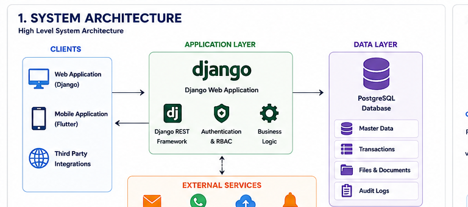

------------------------------------------------------------------------

## 2. Insurance Claim Workflow


------------------------------------------------------------------------

## 3. Job Card Workflow

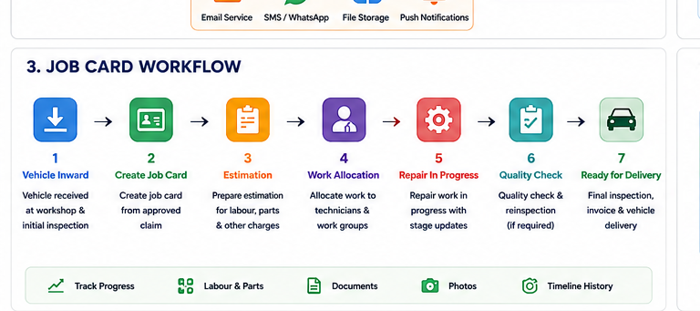

------------------------------------------------------------------------

## 4. Role-Based Access Control (RBAC)

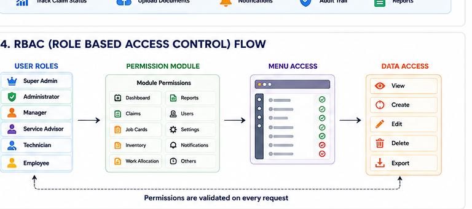

------------------------------------------------------------------------

## 5. Flutter + Django Integration


------------------------------------------------------------------------

## 6. Database ER Diagram

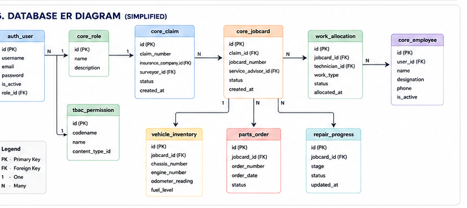

------------------------------------------------------------------------

## 📸 Application Screenshots

> Save all screenshots inside `docs/screenshots/` using the filenames
> below.

### 🔐 Login

Secure authentication with Role-Based Access Control.

``` text
docs/screenshots/login.png
```

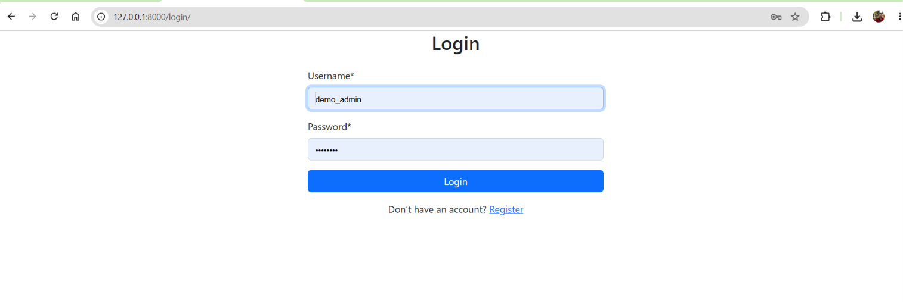

------------------------------------------------------------------------

### 📊 Dashboard

Real-time KPIs, technician workload, active jobs, approvals, and
workshop performance.

``` text
docs/screenshots/dashboard.png
```

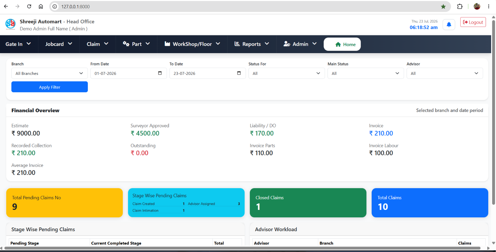

------------------------------------------------------------------------

### 📋 Claim Management

``` text
docs/screenshots/claim-management.png
```

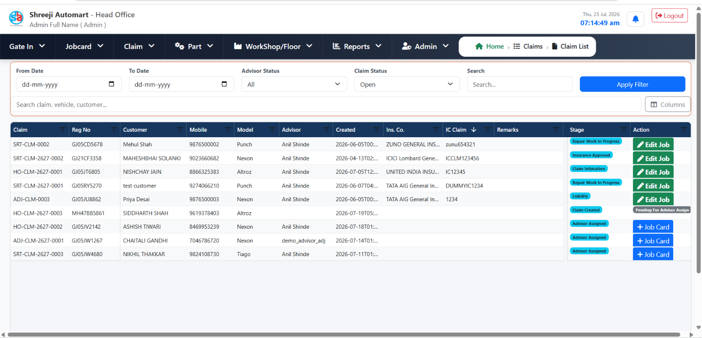

------------------------------------------------------------------------

### 🚗 Job Card Management

``` text
docs/screenshots/jobcard.png
```

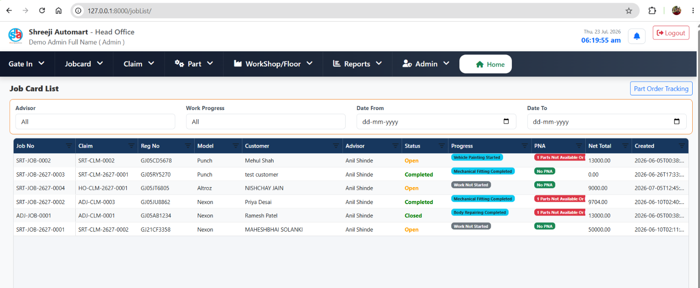

------------------------------------------------------------------------

### 🚙 Vehicle Inventory

``` text
docs/screenshots/vehicle-inventory.png
```

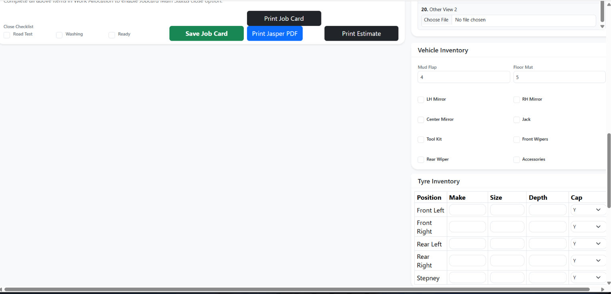

------------------------------------------------------------------------

### 👨‍🔧 Work Allocation

``` text
docs/screenshots/work-allocation.png
```

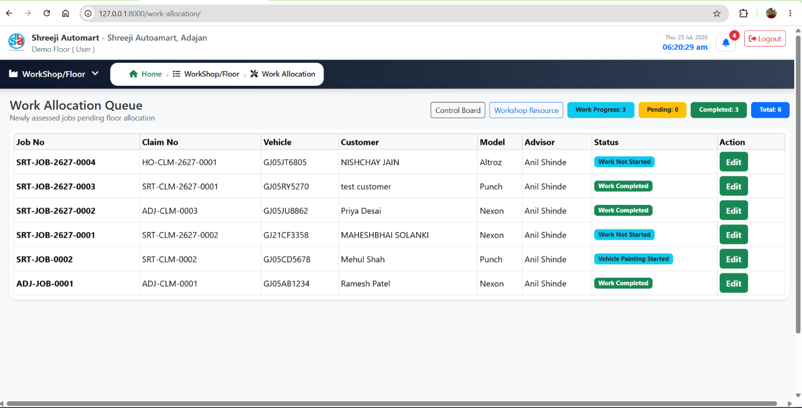

------------------------------------------------------------------------

### 🛠 Repair Progress

``` text
docs/screenshots/repair-progress.png
```

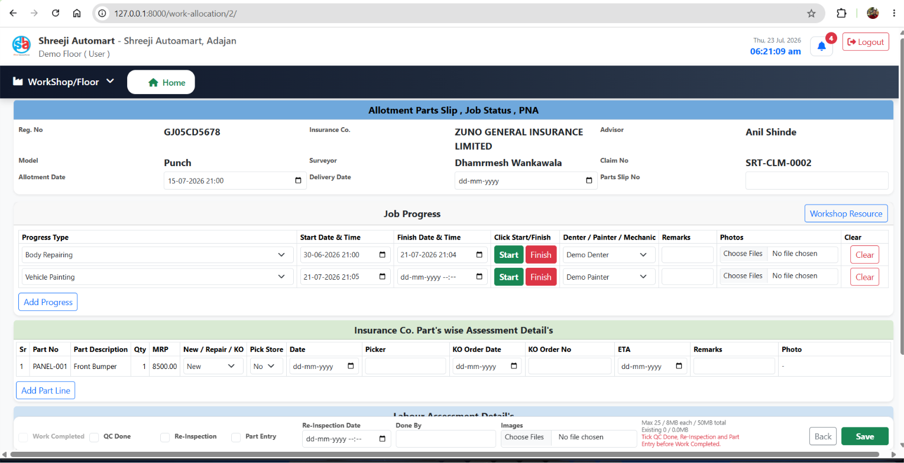
------------------------------------------------------------------------
### 🛠 Parts Requisition & Full Filled Process

``` text
docs/screenshots/part-process.png
```

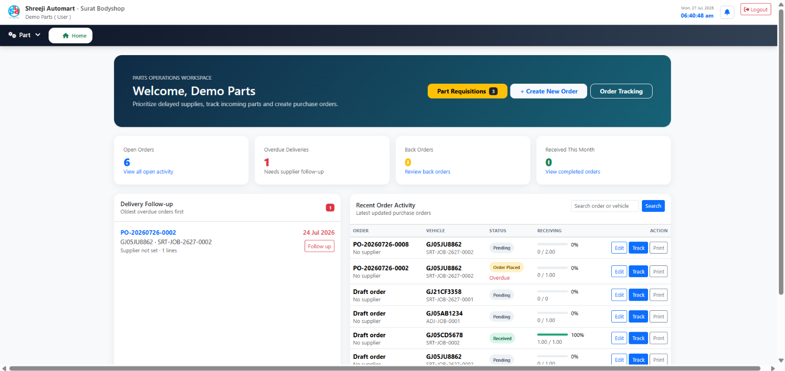
------------------------------------------------------------------------

### 📈 Body Shop Control Board

``` text
docs/screenshots/control-board.png
```

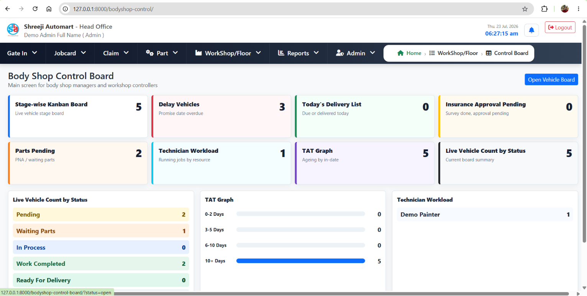

------------------------------------------------------------------------

### 📑 Reports & Analytics

``` text
docs/screenshots/reports.png
```

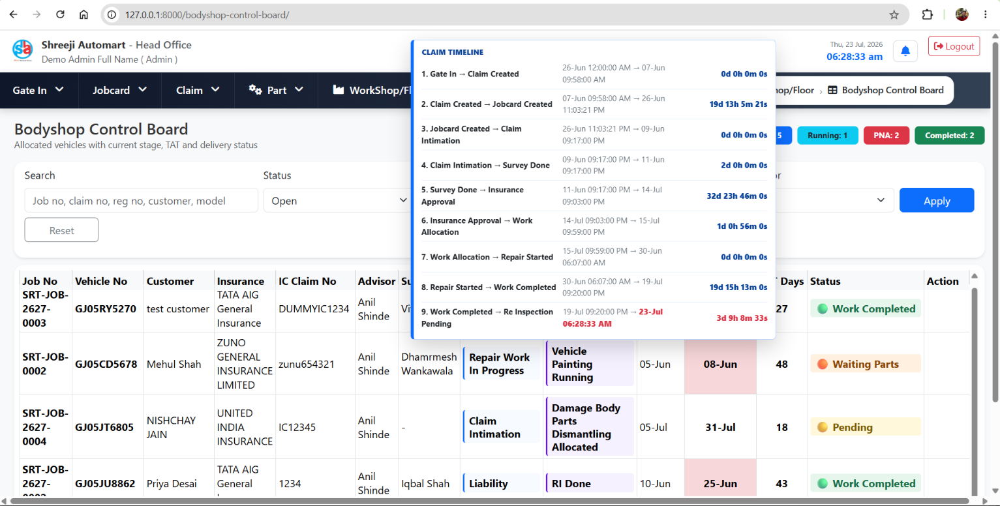

------------------------------------------------------------------------

### 🔒 Role-Based Access Control

``` text
docs/screenshots/rbac.png
```

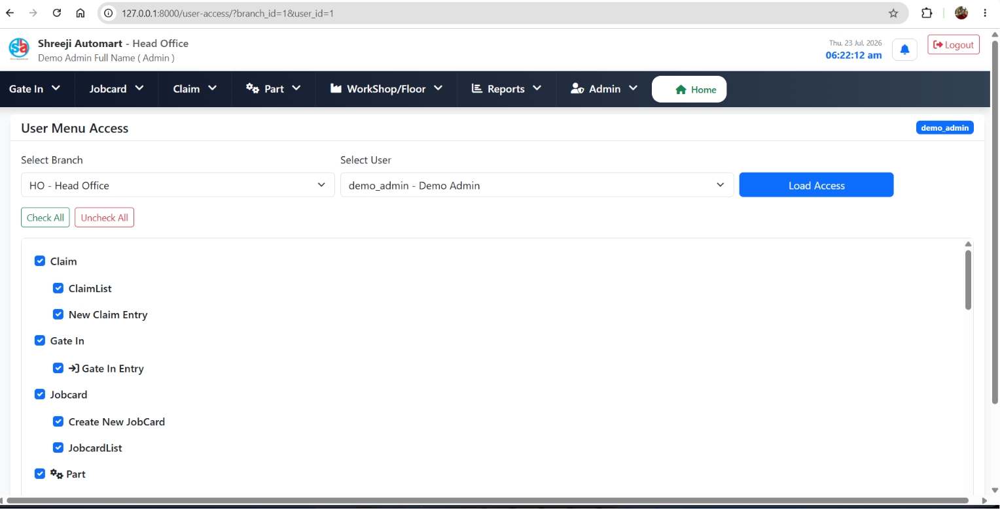

------------------------------------------------------------------------

## 📱 Flutter Mobile Application

### 📲 Mobile Login

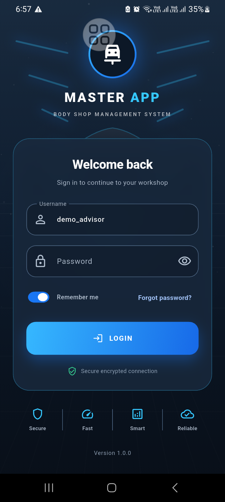

### 📱 Mobile Dashboard

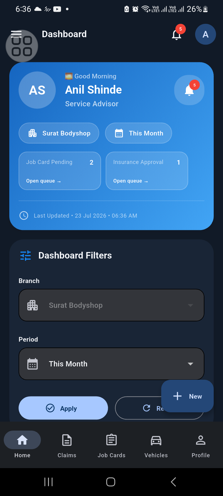

### 🚘 Mobile Repair Progress

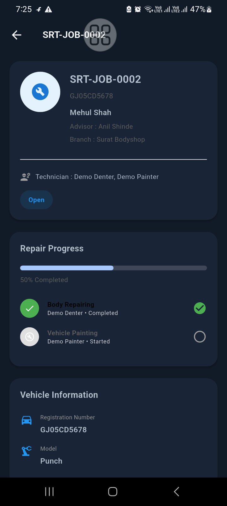

------------------------------------------------------------------------

## Technology Stack

### Backend

-   Python
-   Django
-   Django REST Framework
-   PostgreSQL

### Frontend

-   HTML
-   Bootstrap
-   JavaScript

### Mobile

-   Flutter

------------------------------------------------------------------------

## Installation

``` bash
git clone https://github.com/anilshinde0806-stack/MasterApp.git
cd MasterApp
python -m venv .venv
.venv\Scripts\activate
pip install -r requirements.txt
python manage.py migrate
python manage.py createsuperuser
python manage.py runserver
```

------------------------------------------------------------------------

## Current Features

-   ✅ Insurance Claims
-   ✅ Job Cards
-   ✅ Vehicle Inventory
-   ✅ Work Allocation
-   ✅ Notifications
-   ✅ Reports
-   ✅ Dashboard
-   ✅ RBAC
-   ✅ REST API
-   ✅ PostgreSQL
-   ✅ Flutter Integration

------------------------------------------------------------------------

## Roadmap

-   WhatsApp Customer Portal
-   Insurance Renewal
-   Timeline Tracking
-   Push Notifications
-   CI/CD
-   Production Deployment

------------------------------------------------------------------------

## Author

**Anil Shinde**

GitHub: https://github.com/anilshinde0806-stack
