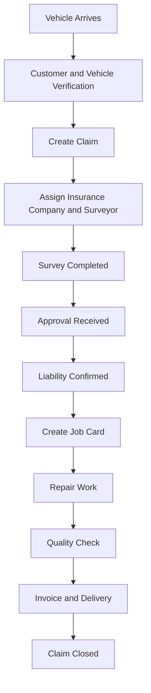

# Insurance Claim Workflow

```mermaid
flowchart TD
    A[Vehicle Arrives] --> B[Customer and Vehicle Verification]
    B --> C[Create Claim]
    C --> D[Assign Insurance Company and Surveyor]
    D --> E[Survey Completed]
    E --> F[Approval Received]
    F --> G[Liability Confirmed]
    G --> H[Create Job Card]
    H --> I[Repair Work]
    I --> J[Quality Check]
    J --> K[Invoice and Delivery]
    K --> L[Claim Closed]
```
