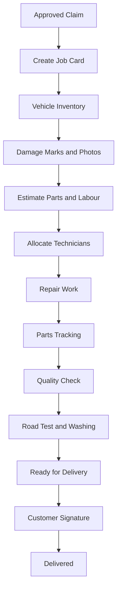

# Job Card Workflow

```mermaid
flowchart TD
    A[Approved Claim] --> B[Create Job Card]
    B --> C[Vehicle Inventory]
    C --> D[Damage Marks and Photos]
    D --> E[Estimate Parts and Labour]
    E --> F[Allocate Technicians]
    F --> G[Repair Work]
    G --> H[Parts Tracking]
    H --> I[Quality Check]
    I --> J[Road Test and Washing]
    J --> K[Ready for Delivery]
    K --> L[Customer Signature]
    L --> M[Delivered]
```
