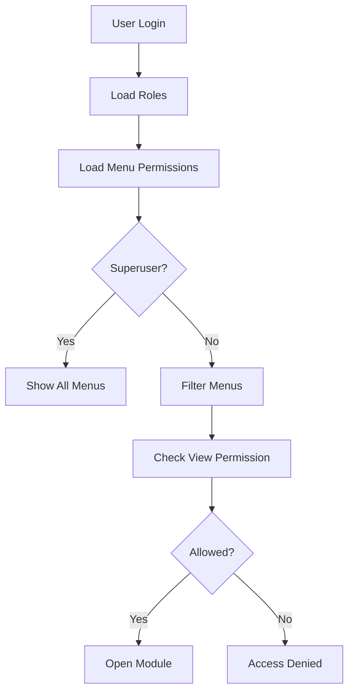

# RBAC Permission Flow

```mermaid
flowchart TD
    A[User Login] --> B[Load Roles]
    B --> C[Load Menu Permissions]
    C --> D{Superuser?}
    D -- Yes --> E[Show All Menus]
    D -- No --> F[Filter Menus]
    F --> G[Check View Permission]
    G --> H{Allowed?}
    H -- Yes --> I[Open Module]
    H -- No --> J[Access Denied]
```

Recommended permissions: View, Add, Change, Delete, Approve, Export, Print, Assign and Close.
