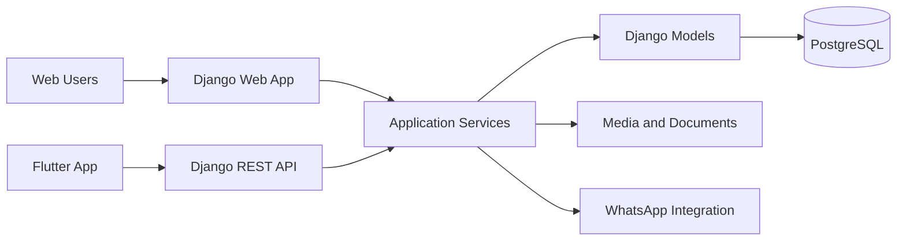

# MasterApp System Architecture

## Main Layers

- Presentation: Django templates, Bootstrap, JavaScript, Flutter
- Application: claim, job-card, dashboard, notification and RBAC services
- Data: Django models and PostgreSQL
- Infrastructure: storage, logging, caching, scheduling and integrations
